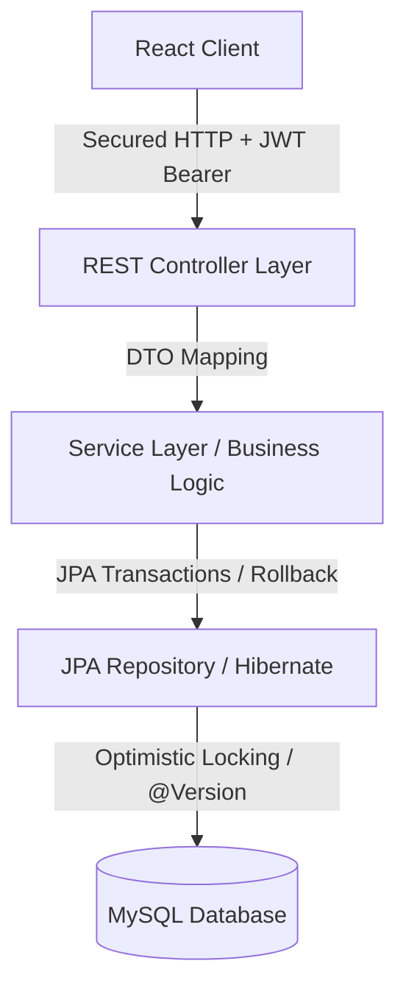

# 🛰️ StockPilot — Enterprise Warehouse & Inventory Telemetry Platform

[](https://spring.io/projects/spring-boot)
[](https://react.dev/)
[](https://tailwindcss.com/)
[](https://www.mysql.com/)
[](https://jwt.io/)

---

## 📋 Project Overview & Business Logic

**StockPilot** is an enterprise-grade cloud inventory management solution designed to handle operations across multiple warehouse depots. In logistics, managing real-time stock levels, avoiding **double-allocations**, and ensuring **transactional safety during stock movements** are critical challenges. 

StockPilot solves these challenges by combining a robust, concurrent Spring Boot 3 backend with a high-fidelity, interactive space-themed React telemetry dashboard.

### Core Problems Solved:
1. **Stock Over-allocation (Double Reservation):** Prevents two orders from claiming the same physical stock concurrently using **Optimistic Locking (`@Version` control)**.
2. **Unsafe Stock Movements:** Ensures that stock transfers between depots are **atomic**—meaning source depletion and target increment happen together or not at all (full transactional rollback support).
3. **Operational Visibility:** Provides logistics managers with active widgets detailing total inventory valuations, vault capacities, active security threat alerts (low stock), and recent telemetry events.

---

## 🛠️ Software Architecture & Design Approach

StockPilot is structured around a **layered architecture** (Controller-Service-Repository) featuring domain entities mapped via Hibernate JPA to a MySQL schema.



### 1. Database Model & Relationships
The relational database contains seven primary entities interacting dynamically:
*   **Warehouse:** Holds physical locations and active capacity constraints.
*   **Product:** The catalog items, including pricing and low-stock threshold triggers.
*   **Inventory:** The join table mapping `Product` relative to `Warehouse`, defining the physical quantities: `onHand`, `reserved`, and `available` (`onHand - reserved`).
*   **SalesOrder & Item:** Outbound customer requests that lock stock on creation and subtract stock on shipping.
*   **PurchaseOrder & Item:** Inbound vendor shipments that add stock on arrival.
*   **StockTransfer & Item:** Depot-to-depot operations.
*   **AuditLog:** Records every operational event for system-wide transparency.

### 2. Guarding Data Consistency (Optimistic Concurrency)
When multiple logistics operators try to modify stock allocations simultaneously, conflicts arise. StockPilot implements **Optimistic Concurrency Control** via JPA version tagging:
```java
@Version
private Long version;
```
If an operator tries to confirm a stock reserve while another operator is editing the inventory, Hibernate detects the mismatch and throws an `OptimisticLockException`, aborting the request and keeping inventory registers verified and correct.

### 3. Role-Based Access Control (RBAC) & Stateful Security
Authentication is handled via stateless Bearer JSON Web Tokens:
*   **`ADMIN` Role:** Access to configuration panels, creating warehouses, registering products, updating suppliers, and approving inter-depot transfers.
*   **`STAFF` Role:** View telemetry maps, request reservations, view logs, and track sales orders.

---

## 📂 Repository Directory Structure

```text
StockPilot_Project/
├── backend/                       # Spring Boot 3 Java Maven Backend
│   ├── src/main/java/             # Core JPA Entity, Services, and REST Controllers
│   ├── src/main/resources/        # application.yml Configuration
│   └── pom.xml                    # Maven Dependency Build File
├── frontend/                      # React 18 + Vite + Tailwind v4 + Lucide Icons
│   ├── src/                       # React Component Modules, State, and API Interceptors
│   ├── index.html                 # Main App Document Entrypoint
│   └── vite.config.js             # Vite Dev Server Configuration
├── .gitignore                     # Repository Version Control Exclusions
└── README.md                      # Setup and Telemetry Audit Documentation
```

---

## 🚀 API Endpoints Overview

### **Authentication**
*   `POST /api/auth/register` — Register a new account.
*   `POST /api/auth/login` — Login to retrieve bearer JWT token.

### **Inventory & Reservations**
*   `GET /api/inventory` — Retrieve all database warehouse inventory allocations.
*   `POST /api/reservations/reserve` — Physically lock stock (manual reservations).

### **Stock Transfers**
*   `GET /api/transfers` — Query transfer history logs.
*   `POST /api/transfers` — Perform multi-item stock transfer between depots (atomic rollback guaranteed).

### **Orders**
*   `GET /api/sales-orders` — List sales orders.
*   `POST /api/sales-orders` — Create new sales order (status `CREATED` - locks inventory).
*   `POST /api/sales-orders/{id}/confirm` — Ship and fulfill sales order (updates physical stock).

---

## 🛠️ Step-by-Step Local Deployment & Verification

### 1. Database Setup (MySQL)
1. Ensure your local MySQL server is started (`port: 3306`).
2. The application is configured to connect to database schema `stockpilot` (it will auto-create if it does not exist) using your local MySQL credentials. The settings can be verified and modified in `backend/src/main/resources/application.yml`.

### 2. Startup Backend Server (Spring Boot)
Open a terminal in the `backend/` directory and execute:
```bash
mvn clean spring-boot:run
```
On startup, `DataInitializer` seeds baseline demonstration mock data (e.g. system operators, warehouses, product catalog entries, and suppliers).

### 3. Startup Frontend Dashboard (React + Vite)
Open a separate terminal in the `frontend/` directory and run:
```bash
npm install
npm run dev
```
Open your browser and navigate to **`http://localhost:5173/`**.

### 4. Seeded Profiles Default Credentials

Use the seeded profiles below to test role-based capabilities:

| Identity | Username | Password | Assigned Role | Capabilities |
| :--- | :--- | :--- | :--- | :--- |
| **System Administrator** | `admin` | `admin123` | `ADMIN` | Full access (Warehouse registration, catalog modifications, supply management, stock transfers) |
| **Logistics Staff** | `staff` | `staff123` | `STAFF` | Operations access (Review allocations, request stock locks/reservations, view charts) |
